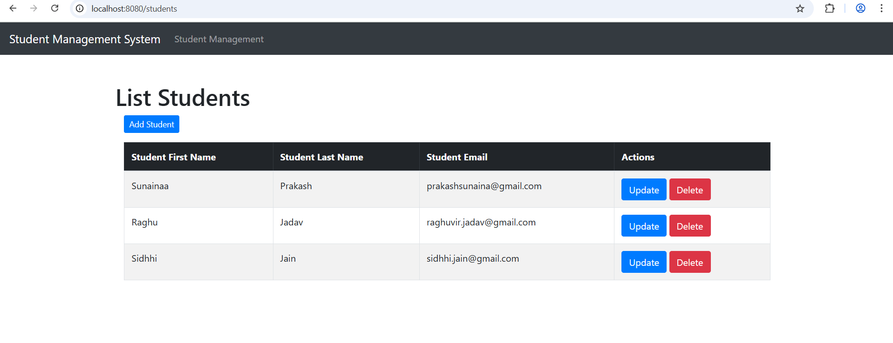
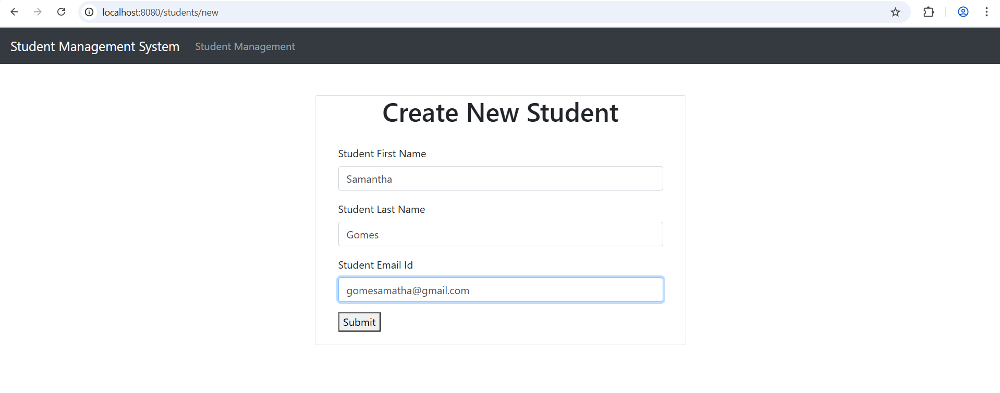
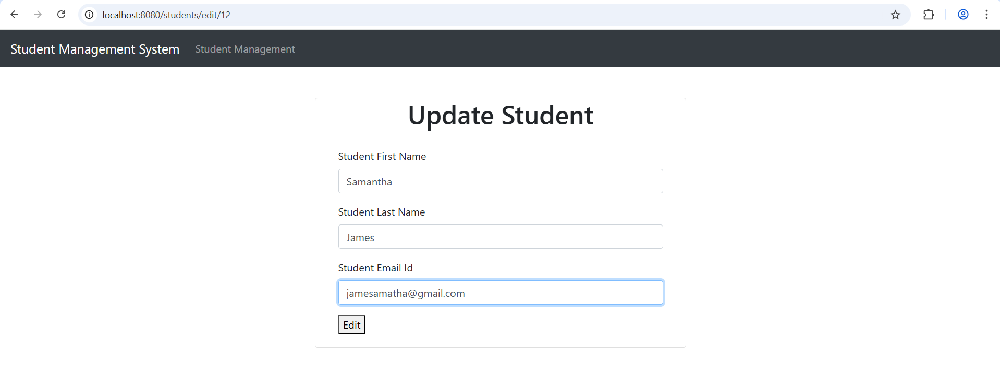
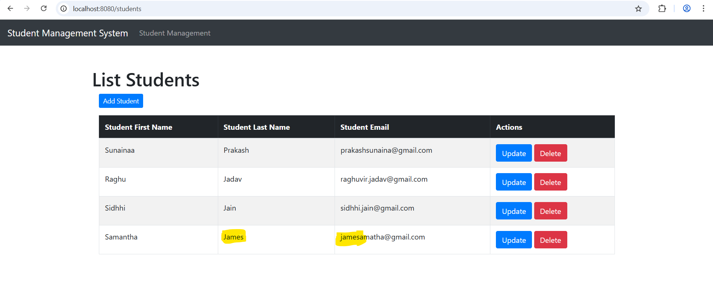
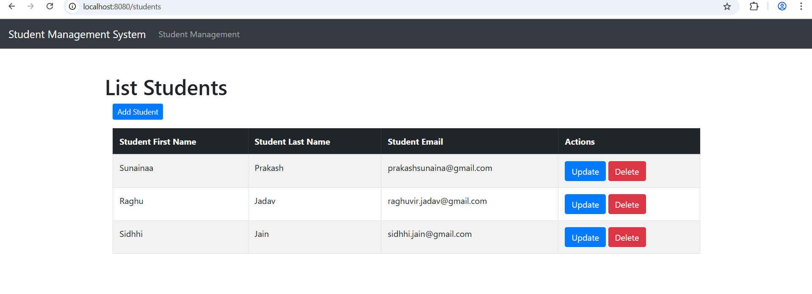

# 🎓 Student Management System  

A **Spring Boot web application** for managing student records.  
Built with **Spring Boot, Thymeleaf, Spring Data JPA, and MySQL**, it supports full CRUD operations – Create, Read, Update, and Delete students – with a clean layered architecture.

---

## ✨ Features
- ➕ Add new students with details (First Name, Last Name, Email)
- 📋 View a list of all students
- ✏️ Update existing student information
- 🗑️ Delete students from the database
- 💻 Responsive UI built with **Bootstrap**
- 🏗️ Layered architecture (**Controller → Service → Repository → Entity**)

---

## 🛠️ Tech Stack
- ☕ **Java 17+**
- 🌱 **Spring Boot**, **Spring MVC**
- 🗄️ **Spring Data JPA (Hibernate)**  
- 🎨 **Thymeleaf + Bootstrap 4**  
- 🐬 **MySQL**  
- 📦 **Maven**

---

## 🚀 Getting Started

### ✅ Prerequisites
- Java 17+
- Maven
- MySQL

### ⚡ Steps to Run

1. **Clone the repository**
   ```bash
   git clone https://github.com/your-username/student-management-system.git
   cd student-management-system
   
2. **Configure MySQL Database**

2.1. Create a database: CREATE DATABASE student_management;

2.2. Update application.properties with your DB credentials:

spring.application.name=StudentManagementSystem

spring.datasource.url = jdbc:mysql://localhost:3306/student_management?useSSL=false&serverTimezone=UTC&useLegacyDatetimeCode = false
spring.datasource.username = root
spring.datasource.password = YOUR_DB_PASSWORD

//Hibernate Dialect
spring.jpa.properties.hibernate.dialect = org.hibernate.dialect.MySQLDialect

// Hibernate auto-ddl
spring.jpa.hibernate.ddl-auto = update

logging.level.org.hibernate.SQL = DEBUG

3. **Build & Run the project**
mvn spring-boot:run

4. **Access the Application on browser**
🌍 http://localhost:8080/students

5. 📸 **Screenshots**

### Student List Page


### Create Student Page


### Update Student Page


### Student List After Update


### Student List After Delete



🗂️ **Project Structure**

  StudentManagementSystem/
├── src/
│   ├── main/
│   │   ├── java/com/pauls/StudentManagementSystem/
│   │   │   ├── controller/StudentController.java
│   │   │   ├── entity/Student.java
│   │   │   ├── repository/StudentRepository.java
│   │   │   └── service/StudentService.java + impl/StudentServiceImpl.java
│   │   └── resources/
│   │       ├── templates/ (students.html, create_student.html, edit_student.html)
│   │       └── application.properties
└── pom.xml

🔮 **Future Enhancements**

🔍 Search and pagination for students

✅ Input validation with Hibernate Validator

🌐 REST API endpoints for external integrations

🔒 Spring Security for authentication & authorization

☁️ Deployment on cloud (AWS/Render)

🤝 **Contributing**

Contributions, issues, and feature requests are welcome!
Feel free to fork the repo and submit a PR.

📜 **License**

📝 This project is licensed under the MIT License.

🙏 **Acknowledgement**

This project was built as part of my Spring Boot learning journey.  
I followed the excellent tutorial series by [Ramesh Fadatare (Java Guides)](https://www.youtube.com/c/JavaGuides) which provided the core structure and guidance.  

